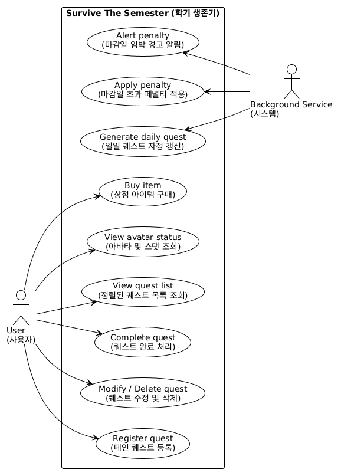
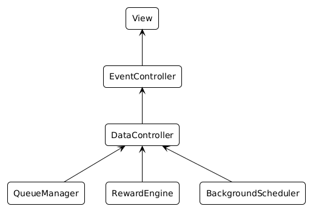

       
  <h1>Survive The Semester (학기 생존기)</h1>
   
  
   
  <h3>- 2. Analysis -</h3>
          
          

- 1 -
Yeungnam University

--- 

**[ Revision history ]**

<table>
  <tr>
    <th width="150" align="center">Revision date</th>
    <th width="100" align="center">Version #</th>
    <th width="400" align="center">Description</th>
    <th width="150" align="center">Author</th>
  </tr>
   <tr>
    <td align="center">2026.04.28</td>
    <td align="center">1.0.0</td>
    <td align="center">Analysis 초안 작성 (Introduction, Use case, Domain 구조화)</td>
    <td align="center">Seungyun-Kim</td>
  </tr>
  <tr>
    <td align="center">2026.05.05</td>
    <td align="center">1.0.1</td>
    <td align="center">Revision작성 및 Introduction, Use case, Domain 구체화</td>
    <td align="center">Seungyun-Kim</td>
  </tr>
</table>

                

- 2 -
Yeungnam University

--- 

## [ Contents ]

<h3>
<code>1. Introduction ......................................................... 3</code> 
   
<code>2. Use case analysis .................................................... 4</code> 
   
<code>3. Domain analysis ...................................................... 7</code> 
   
<code>4. User Interface Prototype ............................................. 8</code> 
   
<code>5. Glossary ............................................................ 10</code> 
   
<code>6. References .......................................................... 10</code>
</h3>

              

- 3 -
Yeungnam University

--- 

## 1. Introduction
본 문서는 Conceptualization 단계의 문서에 이어지는 Analysis 단계의 문서다.

**1.1. Summary** 
대학 생활을 하다 보면 과제, 전공 공부, 어학 등 수많은 일에 치여 살아간다. 이를 효율적으로 수행하기 위해 일정을 관리해야 하지만, 대부분의 학생들은 '귀차니즘'으로 인해 계획을 꾸준히 실천하지 못한다. 기존의 체크리스트 형태의 'To-do 앱'들은 일정을 단순히 나열할 뿐, 사용자의 자발적인 참여를 이끌어내는 즉각적인 보상 체계가 부족했다.

때문에 본 문서에서는 과제 수행을 몬스터 사냥과 생존이라는 RPG 메커니즘으로 치환한 플래너 프로그램(학기 생존기)을 제안한다. 사용자가 게임을 즐기듯 일정을 수행하고 즉각적인 가상 재화(EXP, Gold)를 획득하게 함으로써, 훨씬 능동적이고 효율적으로 일정을 관리할 수 있을 것으로 기대한다.

**1.2 Business Goals** 
* 사용자가 해야 할 과제(퀘스트)의 우선순위를 직관적으로 알 수 있도록 정렬하여 표시해야 한다.
* 사용자가 과제를 완료했을 때 즉각적인 보상(EXP, Gold)을 시스템적으로 제공해야 한다.
* 마감일이 지난 과제에 대해서는 아바타의 체력(HP)을 차감하여 페널티를 부여해야 한다.
* 사용자가 획득한 시스템 내 재화를 자신이 설정한 '셀프 보상'으로 교환할 수 있어야 한다.

**1.3 Technical Goals** 
* 마감일과 난이도를 종합하여 퀘스트의 우선순위를 정확하게 계산하고 정렬(Priority Queue)할 수 있어야 한다.
* 사용자가 앱을 종료한 상태에서도 시간이 흐름에 따라 마감일 초과 페널티와 일일 퀘스트 갱신이 정상적으로 연산되어야 한다. (Background Service)
* 애플리케이션의 데이터(퀘스트 목록, 플레이어 스탯)가 기기 내부에 안전하게 저장되고 불러와져야 한다. (SQLite)
* 사용자의 조작(퀘스트 완료, 상점 이용 등)에 따른 스탯 변화가 지연 없이 UI에 즉각적으로 반영되어야 한다.

      

- 4 -
Yeungnam University

--- 

## 2. Use case analysis

**2.1 Use Case Diagram** 

  
   
  [그림 2-1] Use Case Diagram

 

제안된 시스템은 개인 사용자를 대상으로 하며 백그라운드 연산을 수행하므로 Actor는 User와 Background Service(System) 두 가지로 나뉜다.

*   **Register quest**: 메인 퀘스트 등록
*   **Modify / Delete quest**: 퀘스트 수정 및 삭제
*   **Complete quest**: 퀘스트 완료 처리
*   **View quest list**: 정렬된 퀘스트 목록 조회
*   **View avatar status**: 아바타 및 스탯 조회
*   **Buy item**: 상점 아이템 구매
*   **Generate daily quest**: 일일 퀘스트 자정 갱신 (System)
*   **Apply penalty**: 마감일 초과 페널티 적용 (System)
*   **Alert penalty**: 마감일 임박 경고 알림 (System)

 

**2.2 Use Case Description**

**Use case #1: Register quest (메인 퀘스트 등록)**
<table frame="box" rules="all">
  <tr>
    <td colspan="2"><b>GENERAL CHARACTERISTICS</b></td>
  </tr>
  <tr>
    <td width="200">Summary</td>
    <td width="600">사용자가 수행해야 할 중요 과제(퀘스트명, 마감일, 난이도)를 시스템에 입력하여 신규 등록한다.</td>
  </tr>
  <tr>
    <td>Scope</td>
    <td>Survive The Semester App</td>
  </tr>
  <tr>
    <td>Level</td>
    <td>User Level</td>
  </tr>
  <tr>
    <td>Author</td>
    <td>User</td>
  </tr>
  <tr>
    <td>Last Update</td>
    <td>Analysis</td>
  </tr>
  <tr>
    <td>Primary Actor</td>
    <td>User</td>
  </tr>
  <tr>
    <td>Preconditions</td>
    <td>시스템(앱)이 실행되어 메인 화면이 표출된 상태여야 한다.</td>
  </tr>
  <tr>
    <td>Trigger</td>
    <td>사용자가 메인 화면에서 '+' (추가) 버튼을 클릭할 때</td>
  </tr>
  <tr>
    <td>Success Post Condition</td>
    <td>입력된 정보가 DB에 저장되고 우선순위가 계산되어 목록에 표출된다.</td>
  </tr>
  <tr>
    <td>Failed Post Condition</td>
    <td>필수 정보 누락 시 경고창을 띄우고 추가를 취소한다.</td>
  </tr>
</table>

  

- 5 -
Yeungnam University

--- 

<table frame="box" rules="all">
  <tr>
    <td colspan="2"><b>MAIN SUCCESS SCENARIO</b></td>
  </tr>
  <tr>
    <td width="100" align="center">Step</td>
    <td width="700" align="center">Action</td>
  </tr>
  <tr>
    <td align="center">1</td>
    <td>사용자가 메인 화면에서 '+' 버튼을 클릭한다.</td>
  </tr>
  <tr>
    <td align="center">2</td>
    <td>시스템은 퀘스트 정보(이름, 마감일, 난이도)를 입력할 수 있는 대화창(Dialog)을 띄운다.</td>
  </tr>
  <tr>
    <td align="center">3</td>
    <td>사용자가 퀘스트의 이름, 마감일 날짜, 난이도(상/중/하)를 입력한다.</td>
  </tr>
  <tr>
    <td align="center">4</td>
    <td>사용자가 "등록(Register)" 버튼을 클릭한다.</td>
  </tr>
  <tr>
    <td align="center">5</td>
    <td>시스템은 입력받은 데이터를 로컬 DB에 저장하고 최적의 우선순위 위치에 배치한다.</td>
  </tr>
  <tr>
    <td align="center">6</td>
    <td>시스템은 입력 대화창을 닫고 갱신된 퀘스트 목록을 사용자에게 보여준다.</td>
  </tr>
  <tr>
    <td colspan="2"><b>EXTENSION SCENARIOS</b></td>
  </tr>
  <tr>
    <td align="center">Step</td>
    <td align="center">Branching Action</td>
  </tr>
  <tr>
    <td align="center">4</td>
    <td>
      4a. 사용자가 필수 항목(예: 퀘스트 이름)을 입력하지 않은 경우 
      &nbsp;&nbsp;4a.1. 시스템은 필수 항목을 입력하라는 경고 메시지(Toast)를 띄운다. 
      &nbsp;&nbsp;4a.2. 시스템은 창을 닫지 않고 사용자 입력을 대기한다. (Step 3으로 이동)
    </td>
  </tr>
  <tr>
    <td align="center">4</td>
    <td>
      4b. 사용자가 이미 지나간 과거의 날짜를 마감일로 선택한 경우 
      &nbsp;&nbsp;4b.1. 시스템은 올바른 마감일을 설정하라는 경고 메시지를 띄운다. 
      &nbsp;&nbsp;4b.2. 시스템은 입력을 대기한다. (Step 3으로 이동)
    </td>
  </tr>
  <tr>
    <td colspan="2"><b>RELATED INFORMATION</b></td>
  </tr>
  <tr>
    <td>Performance</td>
    <td>≤ 1 Seconds</td>
  </tr>
</table>

 

**Use case #4: Complete quest (퀘스트 완료 처리)**

<table frame="box" rules="all">
  <tr>
    <td colspan="2"><b>GENERAL CHARACTERISTICS</b></td>
  </tr>
  <tr>
    <td width="200">Summary</td>
    <td width="600">사용자가 실제 현실에서 과제를 마친 직후 완료 버튼을 눌러 경험치(EXP)와 재화(Gold)를 획득한다.</td>
  </tr>
  <tr>
    <td>Scope</td>
    <td>Survive The Semester App</td>
  </tr>
  <tr>
    <td>Level</td>
    <td>User Level</td>
  </tr>
  <tr>
    <td>Primary Actor</td>
    <td>User</td>
  </tr>
  <tr>
    <td>Preconditions</td>
    <td>퀘스트 목록에 최소 1개 이상의 진행 중인 퀘스트가 존재해야 한다.</td>
  </tr>
  <tr>
    <td>Trigger</td>
    <td>사용자가 퀘스트 리스트 내의 특정 퀘스트 항목에서 '완료(공격)' 버튼을 누를 때</td>
  </tr>
  <tr>
    <td>Success Post Condition</td>
    <td>해당 퀘스트가 목록에서 지워지고, 사용자의 스탯(EXP, Gold)이 증가하여 UI에 반영된다.</td>
  </tr>
</table>

  

- 6 -
Yeungnam University

--- 

<table frame="box" rules="all">
  <tr>
    <td colspan="2"><b>MAIN SUCCESS SCENARIO</b></td>
  </tr>
  <tr>
    <td width="100" align="center">Step</td>
    <td width="700" align="center">Action</td>
  </tr>
  <tr>
    <td align="center">1</td>
    <td>사용자가 퀘스트 리스트 중 완료하고자 하는 퀘스트의 '완료' 체크박스 혹은 버튼을 클릭한다.</td>
  </tr>
  <tr>
    <td align="center">2</td>
    <td>시스템은 해당 퀘스트의 난이도를 바탕으로 지급할 보상(EXP, Gold) 수치를 계산한다.</td>
  </tr>
  <tr>
    <td align="center">3</td>
    <td>시스템은 사용자의 누적 데이터에 계산된 보상을 더하여 DB를 업데이트한다.</td>
  </tr>
  <tr>
    <td align="center">4</td>
    <td>시스템은 완료된 퀘스트의 상태를 변경하여 화면 목록에서 보이지 않게 처리한다.</td>
  </tr>
  <tr>
    <td align="center">5</td>
    <td>시스템은 상단 아바타 뷰의 게이지(EXP)와 보유 골드를 즉각적으로 갱신하여 보여준다.</td>
  </tr>
  <tr>
    <td colspan="2"><b>EXTENSION SCENARIOS</b></td>
  </tr>
  <tr>
    <td align="center">Step</td>
    <td align="center">Branching Action</td>
  </tr>
  <tr>
    <td align="center">3</td>
    <td>
      3a. 획득한 경험치로 인해 다음 레벨의 요구 경험치에 도달한 경우 (Level Up) 
      &nbsp;&nbsp;3a.1. 시스템은 사용자의 레벨 수치를 1 증가시킨다. 
      &nbsp;&nbsp;3a.2. 시스템은 레벨업 축하 알림 메시지를 화면에 띄운다. 
      &nbsp;&nbsp;3a.3. 특정 레벨 구간인 경우, 중앙의 아바타 이미지를 다음 단계의 이미지로 진화(변경)시킨다.
    </td>
  </tr>
  <tr>
    <td colspan="2"><b>RELATED INFORMATION</b></td>
  </tr>
  <tr>
    <td>Performance</td>
    <td>≤ 1 Seconds</td>
  </tr>
</table>

 

**Use case #9: Apply penalty (마감일 초과 페널티 적용)**

<table frame="box" rules="all">
  <tr>
    <td colspan="2"><b>GENERAL CHARACTERISTICS</b></td>
  </tr>
  <tr>
    <td width="200">Summary</td>
    <td width="600">백그라운드에서 마감일이 지난 미완료 퀘스트를 탐지하여 체력(HP)을 차감한다.</td>
  </tr>
  <tr>
    <td>Scope</td>
    <td>Survive The Semester App</td>
  </tr>
  <tr>
    <td>Level</td>
    <td>System Level</td>
  </tr>
  <tr>
    <td>Primary Actor</td>
    <td>Background Service (System)</td>
  </tr>
  <tr>
    <td>Preconditions</td>
    <td>로컬 DB에 완료되지 않은 퀘스트 데이터가 존재해야 한다.</td>
  </tr>
  <tr>
    <td>Trigger</td>
    <td>앱이 실행될 때, 혹은 백그라운드 서비스가 주기적으로 시간 동기화를 수행할 때</td>
  </tr>
  <tr>
    <td>Success Post Condition</td>
    <td>마감일이 지난 퀘스트 수에 비례하여 플레이어의 HP가 차감되고 해당 퀘스트는 실패 처리된다.</td>
  </tr>
</table>

  

- 7 -
Yeungnam University

--- 

<table frame="box" rules="all">
  <tr>
    <td colspan="2"><b>MAIN SUCCESS SCENARIO</b></td>
  </tr>
  <tr>
    <td width="100" align="center">Step</td>
    <td width="700" align="center">Action</td>
  </tr>
  <tr>
    <td align="center">1</td>
    <td>시스템(앱 실행 또는 백그라운드 서비스)이 현재 기기의 날짜 및 시간 정보를 가져온다.</td>
  </tr>
  <tr>
    <td align="center">2</td>
    <td>시스템이 DB에 저장된 진행 중인 퀘스트들의 마감일과 현재 시간을 대조한다.</td>
  </tr>
  <tr>
    <td align="center">3</td>
    <td>현재 시간 기준 마감일이 초과된 퀘스트를 색인한다.</td>
  </tr>
  <tr>
    <td align="center">4</td>
    <td>시스템은 초과된 퀘스트의 난이도에 비례하여 플레이어의 HP 차감 수치를 계산한다.</td>
  </tr>
  <tr>
    <td align="center">5</td>
    <td>시스템은 DB의 플레이어 HP를 차감하고, 해당 퀘스트를 '실패(Failed)' 상태로 변경하여 목록에서 제거한다.</td>
  </tr>
  <tr>
    <td colspan="2"><b>EXTENSION SCENARIOS</b></td>
  </tr>
  <tr>
    <td align="center">Step</td>
    <td align="center">Branching Action</td>
  </tr>
  <tr>
    <td align="center">5</td>
    <td>
      5a. 페널티 적용 결과 플레이어의 HP가 0 이하로 떨어진 경우 (Game Over 상태) 
      &nbsp;&nbsp;5a.1. 시스템은 HP를 0으로 고정한다. 
      &nbsp;&nbsp;5a.2. 시스템은 플레이어 보유 Gold의 일정 비율(예: 30%)을 몰수하는 추가 페널티를 적용한다. 
      &nbsp;&nbsp;5a.3. 시스템은 HP를 초기 최대치로 회복시키고 경고 알림(다이얼로그)을 띄운다.
    </td>
  </tr>
  <tr>
    <td colspan="2"><b>RELATED INFORMATION</b></td>
  </tr>
  <tr>
    <td>Performance</td>
    <td>Background task (Immediate upon evaluation)</td>
  </tr>
</table>

 

## 3. Domain analysis

그림 3-1은 Domain analysis의 클래스 구조를 간단하게 나타낸 그림이다.

  
   
  [그림 3-1] Domain Diagram

 

**1) View (UI 레이어)** 
사용자 인터페이스(Android Activity/Fragment)를 통해 사용자의 입력을 받고(버튼 터치, 텍스트 입력) 처리 결과를 화면(리스트, 아바타 이미지, 스탯 바)에 보여주는 독립적인 GUI 모듈이다.

**2) EventController (혹은 ViewModel)** 
View에서 전달받은 사용자의 요청(퀘스트 추가, 완료, 상점 구매 등)을 처리하고 DataController를 통해 필요한 데이터를 가져와서 View로 전달하여 UI 업데이트를 명령한다. 

    

- 8 -
Yeungnam University

--- 

**3) DataController (데이터 관리자)** 
로컬 SQLite Database와의 연결을 담당하며 퀘스트 및 플레이어 데이터를 관리한다. 데이터의 CRUD(저장, 조회, 수정, 삭제) 기능을 지원하며, 복잡한 연산이 필요할 경우 하위 특수 클래스에 로직 처리를 요청한다.

**4) QueueManager (우선순위 큐 연산기)** 
DataController의 요청을 받아, 퀘스트의 마감일과 난이도 가중치를 합산하여 최적의 `Priority Queue`(우선순위 큐) 알고리즘으로 리스트를 정렬하고 응답한다.

**5) RewardEngine (보상/페널티 연산기)** 
과제 완료 시 지급할 EXP와 Gold를 계산하거나, 반대로 마감일 초과 시 차감할 HP를 연산하여 DataController에 전달한다. 레벨업(Level-up) 검증 로직도 이곳에서 수행한다.

**6) BackgroundScheduler** 
앱이 화면에 떠 있지 않은 상태에서도 자정이 되면 일일 퀘스트를 생성(Generate daily quest)하고, 마감일을 확인하여 페널티를 적용하도록 이벤트를 트리거하는 백그라운드 관리 모듈이다.

 

## 4. User Interface Prototype

*(※ UI 프로토타입은 개발 전 와이어프레임이나 목업 스케치 이미지를 삽입하고 부연 설명을 적는 공간입니다. 안드로이드 화면 비율에 맞춘 이미지 캡처본을 넣으시면 됩니다.)*

**4.1 Main Home (메인 화면)** 
그림 4-1은 앱 실행 시 가장 먼저 나타나는 메인 홈 화면이다.

  
   
  [그림 4-1] Main Home

 

화면 상단에는 현재 사용자의 레벨에 맞는 2D 아바타 이미지가 크게 표시되며, 그 아래로 HP, EXP 게이지 바와 현재 보유 Gold량이 시각적으로 나타난다. 화면 하단에는 우선순위에 따라 자동 정렬된 진행 중인 퀘스트 리스트가 나열되며, 우측 하단의 플로팅 액션 버튼(FAB)을 통해 새로운 퀘스트를 등록할 수 있다.

  

- 9 -
Yeungnam University

--- 

**4.2 Register Quest (퀘스트 등록 팝업)** 
그림 4-2는 메인 화면에서 '+' 버튼을 클릭했을 때 나타나는 화면이다.

  
   
  [그림 4-2] Add Quest Dialog

 

팝업 창 형태로 화면 중앙에 띄워진다. '과제명'을 입력하는 텍스트 입력 칸, '마감일'을 선택할 수 있는 달력 픽커(Date Picker), 그리고 '난이도(상/중/하)'를 선택할 수 있는 라디오 버튼이 존재한다. 하단의 '등록' 버튼을 누르면 메인 화면 리스트로 즉시 반영된다.

**4.3 Self-Reward Shop (셀프 보상 상점)** 
그림 4-3은 화면 상단의 상점 아이콘이나 스와이프를 통해 진입할 수 있는 상점 화면이다.

  
   
  [그림 4-3] Shop Layout

 

사용자가 직접 등록한 맞춤형 보상 리스트가 타일 형태로 나열된다. 각 아이템에는 필요한 Gold 가격이 명시되어 있다. 보유 Gold가 충분할 경우 타일이 활성화되며, 구매 버튼을 누르면 해당 재화가 차감되고 "보상 쿠폰이 발급되었습니다!" 라는 애니메이션 효과가 발생한다.

     

- 10 -
Yeungnam University

--- 

## 5. Glossary

<table>
  <tr>
    <th width="150" align="center">용어</th>
    <th width="650" align="center">설명</th>
  </tr>
  <tr>
    <td align="center"><b>Survive The Semester</b></td>
    <td>이 프로젝트(앱)의 이름이다.</td>
  </tr>
  <tr>
    <td align="center"><b>유저 (User / Player)</b></td>
    <td>이 앱을 사용하여 일정을 관리하고 아바타를 육성하는 사용자이다.</td>
  </tr>
  <tr>
    <td align="center"><b>퀘스트 (Quest)</b></td>
    <td>사용자가 수행해야 하는 전공 과제, 어학 공부, 운동 등의 할 일(To-do)을 게임 용어에 빗대어 표현한 것이다.</td>
  </tr>
  <tr>
    <td align="center"><b>HP (Health Point)</b></td>
    <td>플레이어의 체력이다. 퀘스트 마감일을 넘길 시 차감되며, 0이 되면 게임 오버 페널티(모은 재화 삭감 등)를 받는다.</td>
  </tr>
  <tr>
    <td align="center"><b>EXP (Experience Point)</b></td>
    <td>퀘스트 수행을 통해 얻는 경험치이다. 일정 수치가 모이면 플레이어의 레벨이 오르고 아바타 이미지가 진화한다.</td>
  </tr>
  <tr>
    <td align="center"><b>Gold</b></td>
    <td>앱 내에서 통용되는 가상의 재화이다. 퀘스트를 완료하면 얻을 수 있으며 상점에서 보상을 교환할 때 사용한다.</td>
  </tr>
  <tr>
    <td align="center"><b>셀프 보상 (Self-Reward)</b></td>
    <td>상점에서 Gold를 지불하고 얻는 가상의 쿠폰으로, '야구장 직관', '치킨 시켜먹기' 등 현실에서 사용자 스스로에게 주는 맞춤형 보상을 뜻한다.</td>
  </tr>
  <tr>
    <td align="center"><b>우선순위 큐 (Priority Queue)</b></td>
    <td>마감일과 난이도를 계산하여, 가장 시급하게 먼저 해야 할 퀘스트를 목록 맨 위로 올려주는 자료구조 알고리즘이다.</td>
  </tr>
</table>

 

## 6. References

1) Android Developers Official Documentation
   https://developer.android.com
2) Java Platform, Standard Edition Documentation (Oracle)
   https://docs.oracle.com/en/java/
3) "Introduction to Algorithms, 3rd Edition" (Thomas H. Cormen) - 우선순위 큐(Priority Queue) 구현 참조
4) "새해 계획 얼마나 지켰나?…대학생 70% '작심삼일'", 노컷뉴스, 2014.01.10.
   https://www.nocutnews.co.kr/news/1165007
5) "대학생이 꼽은 시간 허비 이유 '1위 귀차니즘'", 서울시티, 2014.02.28.
   http://www.seoulcity.co.kr/news/articleView.html?idxno=121398

              

- 11 -
Yeungnam University
