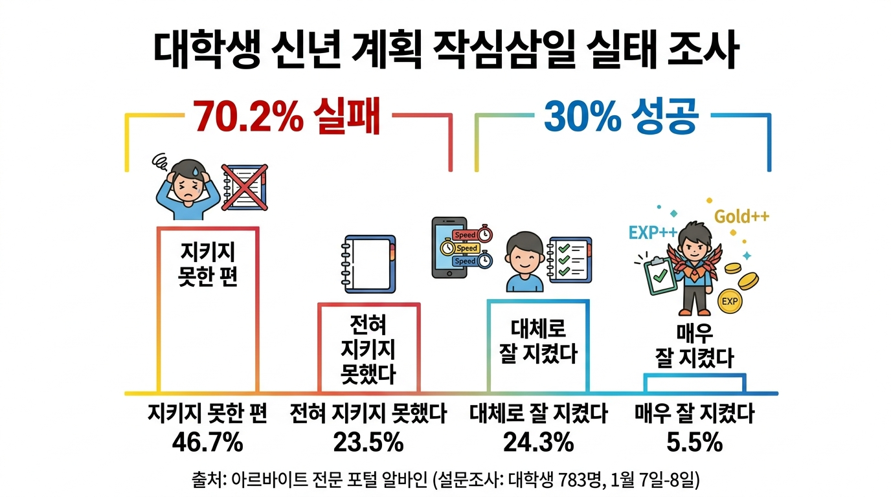
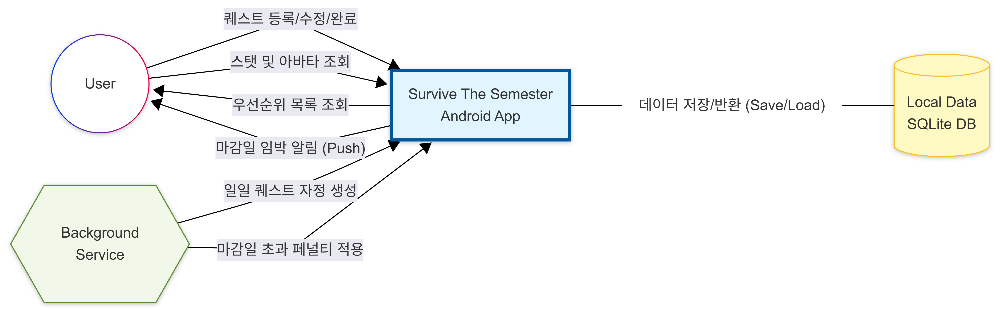

       
  <h1>Survive The Semester (학기 생존기)</h1>
   
  
   
  <h3>- 1. Conceptualization -</h3>
          
          

- 1 -
Yeungnam University

--- 

**[ Revision history ]**

<table>
  <tr>
    <th width="150" align="center">Revision date</th>
    <th width="100" align="center">Version #</th>
    <th width="400" align="center">Description</th>
    <th width="150" align="center">Author</th>
  </tr>
  <tr>
    <td align="center">2026.03.25</td>
    <td align="center">1.0.0</td>
    <td align="center">Conceptualization 초안 작성</td>
    <td align="center">Kimseung-yun</td>
  </tr>
    <tr>
    <td align="center">2026.03.26</td>
    <td align="center">1.0.1</td>
    <td align="center">Conceptualization 목차 정밀 정렬 및 Use case/Concept 항목 세분화(10종), Problem statement 현실화</td>
    <td align="center">Kimseung-yun</td>
  </tr>
  <tr>
    <td align="center">2026.03.27</td>
    <td align="center">1.0.2</td>
    <td align="center">타이틀 표지 및 Business purpose 통계 인포그래픽, System context diagram도식 추가, 전체 페이지 레이아웃 최적화</td>
    <td align="center">Kimseung-yun</td>
  </tr>
</table>

       
       
       

- 2 -
Yeungnam University

--- 

## [ Contents ]

<h3>
<code>1. Business purpose ......................................................... 4</code> 
   
<code>2. System context diagram ................................................... 5</code> 
   
<code>3. Use case list ............................................................ 6</code> 
   
<code>4. Concept of operation ..................................................... 8</code> 
   
<code>5. Problem statement ....................................................... 11</code> 
   
<code>6. Glossary ................................................................ 12</code> 
   
<code>7. References .............................................................. 13</code>
</h3>

          
          

- 3 -
Yeungnam University

--- 

## 1. Business purpose

**1) Project background** 

  

  
  
   
  [그림 1-1] 대학생 신년 계획 작심삼일 실태 조사 (출처: 알바인)
   

 

대학 생활을 하다 보면 전공 공부, 과제, 자격증, 어학 등 수많은 일에 치여 살아간다. 이를 효율적으로 수행하기 위해서는 일정을 관리해야 하지만, 꾸준히 플래너를 작성하고 실천하는 사람은 드물다. 실제로 취업 포털인 '알바인'의 대학생 대상 설문조사에 따르면, 응답자의 약 70%가 계획을 일주일도 지키지 못하는 '작심칠일'을 겪는다고 답했으며, 시간을 허비하는 가장 큰 원인 1위로 '귀차니즘(게으름)'을 꼽았다. 

이는 단순한 의지의 문제를 넘어, 기존의 체크리스트 형태의 플래너들이 '귀찮음'을 이겨낼 만한 즉각적인 보상이나 동기를 제공하지 못하기 때문이다. 따라서 본 프로젝트는 귀찮음을 극복할 강력한 동기 부여를 위해, 게임의 형태와 플래너의 기능을 결합한 '학기 생존기(Survive The Semester)' 앱을 기획하였다. 기존의 단순한 체크리스트 형태의 'To-do 앱'들은 일정을 단순히 나열할 뿐, 사용자의 자발적인 참여와 성취를 이끌어내는 즉각적인 보상 체계가 부족했다. 본 프로젝트는 사용자의 일상적인 '과제 수행'을 '몬스터 사냥 및 생존'이라는 RPG메커니즘으로 치환하여 이 한계를 극복하고자 한다. 

사용자는 앱 내에서 하나의 아바타가 되며, 과제를 완수할 시 경험치와 재화를 획득한다. 반대로 마감일을 초과할 경우 체력이 감소하는 페널티를 부여받음으로써, 억지로 일정을 관리하는 것이 아니라 게임을 즐기듯 능동적으로 일정을 수행하게 된다. 일정 관리에 어려움을 겪고 확실한 동기 부여가 필요한 대학생 및 일반 수험생들이 이 앱의 주 타겟이다. 

무엇보다 이 앱의 가장 큰 차별점은 가상의 성취를 현실로 끌어온다는 점이다. 사용자는 획득한 시스템 내 재화를 통해 '야구장 직관 예매권', 'PC 하드웨어 업그레이드', '자유 휴식 시간' 등 자신이 미리 설정해 둔 맞춤형 현실 보상(Custom Reward) 을 상점에서 교환할 수 있다. 이는 앱 내에서 실제 금전 거래가 이루어지는 것이 아니라, 목표를 달성한 후 스스로에게 약속했던 휴식과 선물을 허락하는 '셀프 보상(Self-Reward)'의 의미를 지닌다. 이를 통해 단순한 일정 관리를 넘어, 사용자에게 실질적이고 강력한 동기를 부여하는 효용성 있는 서비스를 제공하는 것을 궁극적인 목표로 한다.

**2) Goal** 
* **RPG 메커니즘 도입:** 과제 수행을 몬스터 사냥으로 치환하여 즉각적인 보상(EXP, Gold)과 페널티(HP 차감) 부여.
* **강력한 동기 부여:** 사용자가 능동적으로 일정을 관리하고 미루는 습관을 극복할 수 있는 자발적 스케줄링 환경 구축.

**3) Target Market** 
* **주 타겟:** 일정 관리에 어려움을 겪고 즉각적인 동기 부여가 필요한 대학생 및 수험생.
* **핵심 가치:** 앱 내 재화(Gold)를 야구 예매권, PC 부품 구매 등 '현실의 맞춤형 보상'으로 교환하는 실질적 효용성 제공.

      

- 4 -
Yeungnam University

--- 

## 2. System context diagram

아래는 프로젝트의 system context diagram과 시스템 간 상호작용하는 데이터 흐름의 세부 항목이다.

[그림 2-1] System context diagram

 

**[ System Data Flow List ]**

<table frame="void" rules="none">
  <tr>
    <td width="250">• Register quest</td>
    <td>메인 퀘스트 등록</td>
  </tr>
  <tr>
    <td>• Modify / Delete quest</td>
    <td>퀘스트 수정 및 삭제</td>
  </tr>
  <tr>
    <td>• Complete quest</td>
    <td>퀘스트 완료 처리 (몬스터 공격)</td>
  </tr>
  <tr>
    <td>• View quest list</td>
    <td>정렬된 퀘스트 목록 조회</td>
  </tr>
  <tr>
    <td>• View avatar status</td>
    <td>아바타 및 스탯(HP, EXP, Gold) 조회</td>
  </tr>
  <tr>
    <td>• Buy item</td>
    <td>상점 아이템(현실 보상) 구매</td>
  </tr>
  <tr>
    <td>• Alert penalty</td>
    <td>마감일 임박 및 페널티 경고 알림</td>
  </tr>
  <tr>
    <td>• Save / Load data</td>
    <td>로컬 데이터(스탯, 퀘스트 내역) 저장 및 반환</td>
  </tr>
  <tr>
    <td>• Generate daily quest</td>
    <td>일일 퀘스트 자정 갱신</td>
  </tr>
  <tr>
    <td>• Apply penalty</td>
    <td>마감일 초과 HP 차감 페널티 적용</td>
  </tr>
</table>

 

**[ Actors & System ]**

* **User (사용자):** 앱을 통해 신규 퀘스트를 등록(Register) 및 조회(View)하고, 완료 처리(Complete)를 통해 보상을 획득하며 상점에서 아이템을 구매(Buy)한다.
* **System (안드로이드 앱):** UI를 제공하고, 알고리즘(Priority Queue)을 통해 퀘스트의 우선순위를 자동 정렬하며 보상/페널티 산정 엔진을 구동한다.
* **Local Data (SQLite DB):** 플레이어의 현재 스탯과 퀘스트 메타데이터를 기기 내부에 저장(Save)하고 시스템의 요청 시 반환(Load)한다.
* **Background Service:** 앱이 종료된 상태에서도 자정을 기준으로 일일 퀘스트를 갱신(Generate)하고, 마감일 초과 퀘스트를 색인하여 페널티를 적용(Apply)한다.

 

- 5 -
Yeungnam University

--- 

## 3. Use case list

 

**1) 메인 퀘스트 등록 (Register quest)**
<table>
  <tr>
    <th width="150" align="center">Actor</th>
    <td width="650">User</td>
  </tr>
  <tr>
    <th align="center">Description</th>
    <td>사용자가 수행해야 할 중요 과제(퀘스트명, 마감일, 난이도)를 시스템에 입력하여 신규 등록한다.</td>
  </tr>
</table>

 

**2) 퀘스트 수정 (Modify quest)**
<table>
  <tr>
    <th width="150" align="center">Actor</th>
    <td width="650">User</td>
  </tr>
  <tr>
    <th align="center">Description</th>
    <td>사용자가 이미 등록한 퀘스트의 세부 내용(마감일, 난이도 등)을 변경 및 수정한다.</td>
  </tr>
</table>

 

**3) 퀘스트 삭제 (Delete quest)**
<table>
  <tr>
    <th width="150" align="center">Actor</th>
    <td width="650">User</td>
  </tr>
  <tr>
    <th align="center">Description</th>
    <td>사용자가 취소되거나 잘못 입력된 퀘스트를 목록에서 완전히 삭제한다.</td>
  </tr>
</table>

 

**4) 퀘스트 완료 처리 (Complete quest)**
<table>
  <tr>
    <th width="150" align="center">Actor</th>
    <td width="650">User</td>
  </tr>
  <tr>
    <th align="center">Description</th>
    <td>사용자가 실제 현실에서 과제를 마친 직후 완료 버튼을 눌러 경험치(EXP)와 재화(Gold)를 획득한다.</td>
  </tr>
</table>

 

**5) 정렬된 퀘스트 목록 조회 (View quest list)**
<table>
  <tr>
    <th width="150" align="center">Actor</th>
    <td width="650">User</td>
  </tr>
  <tr>
    <th align="center">Description</th>
    <td>사용자가 우선순위 알고리즘에 의해 중요도 순으로 자동 정렬된 전체 퀘스트 목록을 확인한다.</td>
  </tr>
</table>

    

- 6 -
Yeungnam University

--- 

**6) 아바타 및 스탯 조회 (View avatar status)**
<table>
  <tr>
    <th width="150" align="center">Actor</th>
    <td width="650">User</td>
  </tr>
  <tr>
    <th align="center">Description</th>
    <td>사용자가 자신의 현재 체력(HP), 경험치(EXP), 보유 재화(Gold) 및 레벨별 아바타 진화 상태를 확인한다.</td>
  </tr>
</table>

 

**7) 상점 아이템 구매 (Buy item)**
<table>
  <tr>
    <th width="150" align="center">Actor</th>
    <td width="650">User</td>
  </tr>
  <tr>
    <th align="center">Description</th>
    <td>사용자가 모은 Gold를 소모하여 미리 등록해 둔 맞춤형 현실 보상(셀프 보상 쿠폰)을 발급받고 기록한다.</td>
  </tr>
</table>

 

**8) 일일 퀘스트 자정 갱신 (Generate daily quest)**
<table>
  <tr>
    <th width="150" align="center">Actor</th>
    <td width="650">Background Service (System)</td>
  </tr>
  <tr>
    <th align="center">Description</th>
    <td>자정(00:00)이 되면 시스템이 백그라운드에서 가벼운 일일 퀘스트(영단어 암기 등)를 자동 생성하여 리스트에 추가한다.</td>
  </tr>
</table>

 

**9) 마감일 초과 페널티 적용 (Apply penalty)**
<table>
  <tr>
    <th width="150" align="center">Actor</th>
    <td width="650">Background Service (System)</td>
  </tr>
  <tr>
    <th align="center">Description</th>
    <td>시스템이 백그라운드에서 마감일이 지난 미완료 퀘스트를 지속적으로 탐지하여 플레이어의 체력을 즉각 차감시킨다.</td>
  </tr>
</table>

 

**10) 마감일 임박 경고 알림 (Alert penalty)**
<table>
  <tr>
    <th width="150" align="center">Actor</th>
    <td width="650">Background Service (System)</td>
  </tr>
  <tr>
    <th align="center">Description</th>
    <td>마감일이 임박한 퀘스트가 있을 경우, 사용자가 잊지 않고 완료할 수 있도록 시스템이 푸시 알림(Push Notification)을 발송한다.</td>
  </tr>
</table>

    

- 7 -
Yeungnam University

--- 

## 4. Concept of operation

 

**1) 메인 퀘스트 등록 (Register quest)**
<table>
  <tr>
    <th width="150" align="left">Purpose</th>
    <td width="650">사용자가 수행해야 할 중요 과제 및 일정을 시스템에 등록한다.</td>
  </tr>
  <tr>
    <th align="left">Approach</th>
    <td>과제명, 마감일(Deadline), 난이도(Difficulty) 정보를 입력받아 데이터베이스에 저장한다.</td>
  </tr>
  <tr>
    <th align="left">Dynamics</th>
    <td>새로운 학업 일정이나 개인 과제가 발생했을 때 사용자가 능동적으로 입력 이벤트를 발생시킨다.</td>
  </tr>
  <tr>
    <th align="left">Goals</th>
    <td>불규칙한 사용자의 일정을 시스템이 연산 및 통제할 수 있는 규격화된 데이터로 변환한다.</td>
  </tr>
</table>

 

**2) 퀘스트 수정 (Modify quest)**
<table>
  <tr>
    <th width="150" align="left">Purpose</th>
    <td width="650">이미 등록된 과제의 일정이 변경되었을 때 유연하게 대처한다.</td>
  </tr>
  <tr>
    <th align="left">Approach</th>
    <td>등록된 퀘스트 객체를 호출하여 마감일, 난이도 등의 속성값을 덮어쓰기(Update) 한다.</td>
  </tr>
  <tr>
    <th align="left">Dynamics</th>
    <td>교수의 일정 변경이나 사용자의 개인 사정으로 과제 마감일이 조정된 경우.</td>
  </tr>
  <tr>
    <th align="left">Goals</th>
    <td>데이터의 최신화 및 무결성을 유지하여 페널티 시스템이 오작동하지 않도록 방지한다.</td>
  </tr>
</table>

 

**3) 퀘스트 삭제 (Delete quest)**
<table>
  <tr>
    <th width="150" align="left">Purpose</th>
    <td width="650">잘못 입력되었거나 수행할 필요가 없어진 퀘스트를 제거한다.</td>
  </tr>
  <tr>
    <th align="left">Approach</th>
    <td>목록에서 해당 퀘스트를 선택하여 로컬 데이터베이스에서 완전히 삭제(Delete) 처리한다.</td>
  </tr>
  <tr>
    <th align="left">Dynamics</th>
    <td>수강 정정으로 인한 과제 취소 등, 더 이상 퀘스트를 수행할 필요가 없어진 경우.</td>
  </tr>
  <tr>
    <th align="left">Goals</th>
    <td>불필요한 데이터가 리스트를 차지하여 사용자의 혼란을 가중시키는 것을 방지한다.</td>
  </tr>
</table>

       

- 8 -
Yeungnam University

--- 

**4) 퀘스트 완료 처리 (Complete quest)**
<table>
  <tr>
    <th width="150" align="left">Purpose</th>
    <td width="650">수행을 마친 과제를 시스템 상에서 완료 처리하고 그에 상응하는 보상을 획득한다.</td>
  </tr>
  <tr>
    <th align="left">Approach</th>
    <td>퀘스트 완료 버튼을 트리거하면, 시스템 보상 엔진이 난이도 가중치를 연산하여 플레이어의 EXP와 Gold를 증가시키고 해당 퀘스트를 숨김 처리한다.</td>
  </tr>
  <tr>
    <th align="left">Dynamics</th>
    <td>사용자가 실제 현실에서 목표한 과제를 성공적으로 마친 직후 앱을 실행하여 상호작용하는 경우.</td>
  </tr>
  <tr>
    <th align="left">Goals</th>
    <td>사용자에게 즉각적이고 시각적인 긍정적 강화를 제공하여 지속적인 행동 유발을 이끌어낸다.</td>
  </tr>
</table>

 

**5) 정렬된 퀘스트 목록 조회 (View quest list)**
<table>
  <tr>
    <th width="150" align="left">Purpose</th>
    <td width="650">다수의 과제 중 가장 먼저 처리해야 할 과제를 최상단에 노출하여 우선순위를 제시한다.</td>
  </tr>
  <tr>
    <th align="left">Approach</th>
    <td><code>Priority Queue</code>(우선순위 큐) 자료구조를 활용하여, 마감일 임박도와 난이도를 합산한 가중치를 기준으로 퀘스트 리스트를 동적 정렬하여 화면에 렌더링한다.</td>
  </tr>
  <tr>
    <th align="left">Dynamics</th>
    <td>애플리케이션 초기 실행 시, 혹은 새로운 퀘스트 객체가 추가 및 완료 처리될 경우.</td>
  </tr>
  <tr>
    <th align="left">Goals</th>
    <td>어떤 과제부터 해야 할지 고민하는 스케줄링 소모 시간을 최소화하여 즉각적인 실행을 돕는다.</td>
  </tr>
</table>

 

**6) 아바타 및 스탯 조회 (View avatar status)**
<table>
  <tr>
    <th width="150" align="left">Purpose</th>
    <td width="650">사용자의 현재 상태와 성장 진행도를 직관적으로 파악하게 하여 RPG적 재미를 부여한다.</td>
  </tr>
  <tr>
    <th align="left">Approach</th>
    <td>메인 화면 상단에 사용자의 HP, EXP, 보유 Gold를 게이지 바 형태로 시각화하고, 누적 레벨에 따라 미리 세팅된 아바타 일러스트를 매핑하여 보여준다.</td>
  </tr>
  <tr>
    <th align="left">Dynamics</th>
    <td>수시로 앱을 열어 자신의 스탯을 확인하거나, 과제 완료 후 레벨업이 발생했을 경우.</td>
  </tr>
  <tr>
    <th align="left">Goals</th>
    <td>성장하는 아바타를 통해 시각적 성취감을 제공하고 시스템에 대한 몰입도를 극대화한다.</td>
  </tr>
</table>

 

**7) 상점 아이템 구매 (Buy item - 셀프 보상 교환)**
<table>
  <tr>
    <th width="150" align="left">Purpose</th>
    <td width="650">실제 금전 거래가 이루어지는 쇼핑몰이 아니라, 시스템 재화(Gold)를 소모해 스스로 지정한 '나에게 주는 선물(Self-Reward)' 가상 쿠폰을 발급받는다.</td>
  </tr>
  <tr>
    <th align="left">Approach</th>
    <td>사용자가 스스로 보상 내용(예: '2시간 낮잠', '치킨 시켜먹기')과 요구 Gold를 사전에 등록해 둔다. 목표 Gold 도달 시 이를 차감하여 가상 쿠폰을 발급하고 사용 내역을 기록한다.</td>
  </tr>
  <tr>
    <th align="left">Dynamics</th>
    <td>보유 Gold가 목표 수치를 충족하여, 사용자 스스로에게 확실한 보상과 휴식을 허락하고자 할 때.</td>
  </tr>
  <tr>
    <th align="left">Goals</th>
    <td>앱 내의 가상 성취를 사용자의 실제 생활 속 실질적인 동기부여(Self-Motivation)로 연결한다.</td>
  </tr>
</table>

 

- 9 -
Yeungnam University

--- 

**8) 일일 퀘스트 자정 갱신 (Generate daily quest)**
<table>
  <tr>
    <th width="150" align="left">Purpose</th>
    <td width="650">앱 접속 빈도를 높이고 사용자에게 매일 가벼운 성취 목표를 제공한다.</td>
  </tr>
  <tr>
    <th align="left">Approach</th>
    <td>매일 자정, 안드로이드 백그라운드 스케줄러가 '영단어 10개 암기' 등 가벼운 <code>DailyQuest</code> 객체를 자동으로 DB에 Insert 한다.</td>
  </tr>
  <tr>
    <th align="left">Dynamics</th>
    <td>기기 시스템 시간이 자정(00:00)을 지나는 시점.</td>
  </tr>
  <tr>
    <th align="left">Goals</th>
    <td>무거운 전공 과제가 없는 날에도 일상적인 목표 달성을 유도하여 꾸준한 앱 사용(Retention)을 유지한다.</td>
  </tr>
</table>

 

**9) 마감일 초과 페널티 적용 (Apply penalty)**
<table>
  <tr>
    <th width="150" align="left">Purpose</th>
    <td width="650">과제를 미루는 사용자에게 손실 회피 심리를 자극하여 행동 강제한다.</td>
  </tr>
  <tr>
    <th align="left">Approach</th>
    <td>백그라운드 서비스가 주기적으로 퀘스트의 마감일과 현재 시간을 대조하여, 초과된 미완료 과제가 발견될 시 플레이어의 체력(HP) 데이터를 즉각 차감한다.</td>
  </tr>
  <tr>
    <th align="left">Dynamics</th>
    <td>등록된 과제의 마감 기한이 경과하였음에도 사용자가 완료(Complete) 처리를 하지 않은 경우.</td>
  </tr>
  <tr>
    <th align="left">Goals</th>
    <td>체력이 모두 소진되었을 때의 심각한 페널티(골드 몰수 등)를 피하기 위해 학업 지연 습관을 교정한다.</td>
  </tr>
</table>

 

**10) 마감일 임박 경고 알림 (Alert penalty)**
<table>
  <tr>
    <th width="150" align="left">Purpose</th>
    <td width="650">마감일이 다가오는 과제를 사용자가 인지하지 못하고 놓치는 상황을 방지한다.</td>
  </tr>
  <tr>
    <th align="left">Approach</th>
    <td>마감 시간 24시간 전 등 특정 임계 시간에 도달하면, 시스템이 안드로이드 OS의 푸시 알림(Push Notification) 기능을 호출하여 기기 화면에 경고 메시지를 띄운다.</td>
  </tr>
  <tr>
    <th align="left">Dynamics</th>
    <td>우선순위가 높은 과제의 마감일이 사용자 설정 시간 내로 임박한 경우.</td>
  </tr>
  <tr>
    <th align="left">Goals</th>
    <td>사용자가 앱을 실행하지 않은 상태에서도 중요한 일정을 상기시켜 주어 플래너로서의 역할을 완수한다.</td>
  </tr>
</table>

       

- 10 -
Yeungnam University

--- 

## 5. Problem statement

시스템은 사용자의 과제 일정을 파악하여 우선순위에 따라 분류하고, RPG 게임 요소를 통해 상호작용해야 한다. 아래는 학부 전공생 수준의 프로젝트에서 이 앱을 실제로 개발하기 위해 해결해야 할 현실적인 문제와 구현 방향이다.

**5.1 과제 우선순위 알고리즘 적용** 
과제가 여러 개 있을 때 어떤 것부터 해야 할지 시스템이 합리적으로 결정해 주어야 한다. 단순히 날짜순으로 나열하는 것을 넘어, 마감일이 며칠 남았는지와 사용자가 입력한 난이도를 계산해야 한다. 이를 통해 가장 시급한 퀘스트를 리스트 최상단에 올려주는 정렬 로직을 버그 없이 정확하게 구현하는 것이 핵심 과제이다.

**5.2 앱 종료 시의 시간 흐름과 페널티 처리** 
사용자가 앱을 끄고 있는 동안에도 현실의 시간은 흘러 마감일이 지나게 된다. 따라서 자정이 되었을 때 일일 퀘스트를 초기화하고, 마감일을 넘긴 과제가 있다면 캐릭터의 체력(HP)을 깎아야 한다. 이를 위해 안드로이드의 기본적인 백그라운드 서비스를 활용하거나, 사용자가 앱을 다시 실행했을 때 접속하지 않았던 시간 동안의 날짜 차이를 계산해서 페널티를 일괄 적용하는 방식으로 문제를 해결해야 한다.

**5.3 디자인 리소스의 한계 극복** 
RPG 게임의 재미를 살리려면 레벨업에 맞춰 진화하는 아바타 이미지가 필수적이다. 하지만 코딩과 개발을 담당하는 학생들 입장에서 고품질의 게임 그래픽을 직접 그리는 것은 시간적으로나 기술적으로 한계가 명확하다. 이 문제는 최신 생성형 AI 도구를 적극적으로 활용해 필요한 2D 캐릭터 이미지 소스를 만들어내는 방식으로 해결할 수 있다.

**5.4 데이터 저장 및 사용자 편의성 (NFRS)** 
앱을 껐다 켜도 플레이어의 레벨과 과제 목록이 초기화되지 않아야 한다. 복잡한 외부 서버를 구축하고 연동하는 대신, 안드로이드 기기 내부의 로컬 데이터베이스(SQLite)를 활용해 개발 비용 없이 데이터를 안전하고 빠르게 저장한다. 또한, 사용자 인터페이스(GUI)는 "Simple is best" 라는 원칙에 따라 복잡한 설명 없이도 직관적으로 퀘스트를 추가하고 완료(공격)할 수 있도록 구현해야 한다.

       

- 11 -
Yeungnam University

--- 

 

## 6. Glossary

<table>
  <tr>
    <th width="150" align="center">용어</th>
    <th width="650" align="center">설명</th>
  </tr>
  <tr>
    <td align="center"><b>Survive The Semester</b></td>
    <td>이 프로젝트(앱)의 이름이다.</td>
  </tr>
  <tr>
    <td align="center"><b>유저 (User / Player)</b></td>
    <td>이 앱을 사용하여 일정을 관리하고 아바타를 육성하는 사용자이다.</td>
  </tr>
  <tr>
    <td align="center"><b>퀘스트 (Quest)</b></td>
    <td>사용자가 수행해야 하는 전공 과제, 어학 공부, 운동 등의 할 일(To-do)을 게임 용어에 빗대어 표현한 것이다.</td>
  </tr>
  <tr>
    <td align="center"><b>HP (Health Point)</b></td>
    <td>플레이어의 체력이다. 퀘스트 마감일을 넘길 시 차감되며, 0이 되면 게임 오버 페널티(모은 재화 삭감 등)를 받는다.</td>
  </tr>
  <tr>
    <td align="center"><b>EXP (Experience Point)</b></td>
    <td>퀘스트 수행을 통해 얻는 경험치이다. 일정 수치가 모이면 플레이어의 레벨이 오르고 아바타 이미지가 진화한다.</td>
  </tr>
  <tr>
    <td align="center"><b>Gold</b></td>
    <td>앱 내에서 통용되는 가상의 재화이다. 퀘스트를 완료하면 얻을 수 있으며 상점에서 보상을 교환할 때 사용한다.</td>
  </tr>
  <tr>
    <td align="center"><b>셀프 보상 (Self-Reward)</b></td>
    <td>상점에서 Gold를 지불하고 얻는 가상의 쿠폰으로, '야구장 직관', '치킨 시켜먹기' 등 현실에서 사용자 스스로에게 주는 맞춤형 보상을 뜻한다.</td>
  </tr>
  <tr>
    <td align="center"><b>우선순위 큐 (Priority Queue)</b></td>
    <td>마감일과 난이도를 계산하여, 가장 시급하게 먼저 해야 할 퀘스트를 목록 맨 위로 올려주는 자료구조 알고리즘이다.</td>
  </tr>
</table>

        

- 12 -
Yeungnam University

--- 

## 7. References

1) Android Developers Official Documentation
   https://developer.android.com
2) Java Platform, Standard Edition Documentation (Oracle)
   https://docs.oracle.com/en/java/
3) "Introduction to Algorithms, 3rd Edition" (Thomas H. Cormen) - 우선순위 큐(Priority Queue) 구현 참조
4) "새해 계획 얼마나 지켰나?…대학생 70% '작심삼일'", 노컷뉴스, 2014.01.10.
   https://www.nocutnews.co.kr/news/1165007
5) "대학생이 꼽은 시간 허비 이유 '1위 귀차니즘'", 서울시티, 2014.02.28.
   http://www.seoulcity.co.kr/news/articleView.html?idxno=121398

                    

- 13 -
Yeungnam University
