

       
  <h1>Survive The Semester (학기 생존기)</h1>
   
  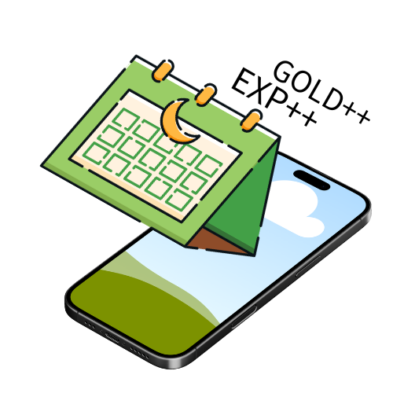
   
  <h3>- 3. Design -</h3>
          
          

- 1 -
Yeungnam University

--- 

**[ Revision history ]**

<table frame="box" rules="all" width="100%">
  <tr>
    <th width="150" align="center" bgcolor="#f2f2f2">Revision date</th>
    <th width="100" align="center" bgcolor="#f2f2f2">Version #</th>
    <th width="400" align="center" bgcolor="#f2f2f2">Description</th>
    <th width="150" align="center" bgcolor="#f2f2f2">Author</th>
  </tr>
  <tr>
    <td align="center">2026.05.31</td>
    <td align="center">1.0</td>
    <td align="center">Design 문서 초안 작성 (다이어그램 텍스트 명세화)</td>
    <td align="center">Seungyun-Kim</td>
  </tr>
  <tr>
    <td align="center">2026.06.5</td>
    <td align="center">1.1</td>
    <td align="center">Design 내용 수정</td>
    <td align="center">Seungyun-Kim</td>
  </tr>
</table>

                

- 2 -
Yeungnam University

--- 

## [ Contents ]

<h3>
<code>1. Introduction ......................................................... 3</code> 
   
<code>2. Class Diagram ........................................................ 4</code> 
   
<code>3. Sequence Diagram ..................................................... 8</code> 
   
<code>4. State Machine Diagram ............................................... 17</code> 
   
<code>5. Implementation Requirements ......................................... 19</code> 
   
<code>6. Glossary ............................................................ 19</code> 
   
<code>7. References .......................................................... 20</code>
</h3>

              

- 3 -
Yeungnam University

--- 

## 1. Introduction

본 문서는 Analysis 단계의 문서에 이어지는 Design 단계의 문서다. 

Analysis 단계에서 도출한 요구사항, Use Case, Domain 구조를 바탕으로 실제 소프트웨어 구현에 필요한 시스템의 정적/동적 구조를 설계한다. 본 문서에서는 다음의 다이어그램들을 다룬다.

 

**1.1 Class Diagram (클래스 다이어그램)** 
객체지향 설계의 핵심 단위인 Class를 이용하여 시스템의 정적인 구조를 표현한다. 각 클래스의 속성과 메서드, 그리고 클래스 간의 상속 및 연관 관계를 정의한다.

 

**1.2 Sequence Diagram (시퀀스 다이어그램)** 
시스템 내의 주요 Use Case 9가지가 실행될 때, 객체들 간의 동적 상호작용을 시간의 흐름에 따라 모델링한다. 사용자의 입력부터 데이터베이스 처리, 그리고 백그라운드 서비스의 연산 과정까지 메시지 전달 흐름을 명확히 한다.

 

**1.3 State Machine Diagram (상태 머신 다이어그램)** 
시스템 내 주요 객체가 생명주기 동안 경험하는 상태의 변화와 그 상태를 변이시키는 이벤트 및 조건들을 모델링한다.

       

- 4 -
Yeungnam University

--- 

## 2. Class Diagram

그림 2-1은 본 시스템의 전체적인 클래스 구조와 관계를 나타내는 Class Diagram이다. UI 레이어(Activity), 컨트롤러 및 연산 레이어(Manager/Engine), 데이터 레이어(Database/Entity)로 명확히 역할이 분리되어 있다.

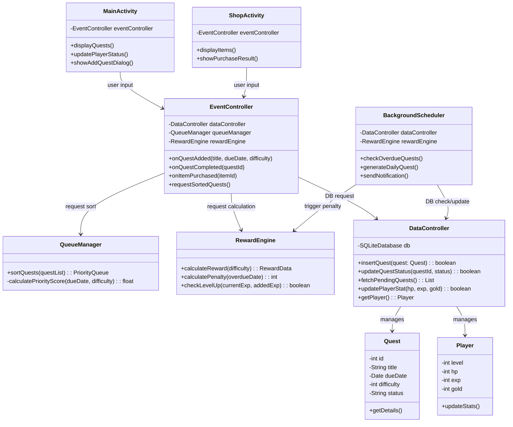

  

### 2.1 Class Description

**1) MainActivity**
<table frame="box" rules="all" width="100%">
  <tr>
    <td bgcolor="#b4c6e7"><b>Attributes</b></td>
  </tr>
  <tr>
    <td>
      eventController: EventController : 사용자의 이벤트를 전달할 컨트롤러 객체
    </td>
  </tr>
  <tr>
    <td bgcolor="#b4c6e7"><b>Methods</b></td>
  </tr>
  <tr>
    <td>
      displayQuests(): void : 우선순위로 정렬된 퀘스트 목록을 화면에 출력하기 
      updatePlayerStatus(): void : 플레이어의 스탯(HP, EXP 등) 및 아바타 갱신하기 
      showAddQuestDialog(): void : 퀘스트 추가 팝업 다이얼로그를 화면에 띄우기
    </td>
  </tr>
  <tr>
    <td bgcolor="#b4c6e7"><b>Description</b></td>
  </tr>
  <tr>
    <td>
      사용자와 상호작용하는 안드로이드의 메인 View 역할을 담당한다. 비즈니스 로직은 직접 처리하지 않고 화면 렌더링에 집중하며, 유저의 클릭이나 텍스트 입력 등의 이벤트를 캡처하여 EventController로 전달한다.
    </td>
  </tr>
</table>

 

**2) ShopActivity**
<table frame="box" rules="all" width="100%">
  <tr>
    <td bgcolor="#b4c6e7"><b>Attributes</b></td>
  </tr>
  <tr>
    <td>
      eventController: EventController : 사용자의 이벤트를 전달할 컨트롤러 객체
    </td>
  </tr>
  <tr>
    <td bgcolor="#b4c6e7"><b>Methods</b></td>
  </tr>
  <tr>
    <td>
      displayItems(): void : 구매 가능한 셀프 보상 아이템 목록을 화면에 출력하기 
      showPurchaseResult(): void : 아이템 구매 성공/실패 여부에 따른 팝업과 애니메이션 띄우기
    </td>
  </tr>
  <tr>
    <td bgcolor="#b4c6e7"><b>Description</b></td>
  </tr>
  <tr>
    <td>
      셀프 보상 상점 화면을 담당하는 View 클래스이다. 사용자의 아이템 구매 요청을 EventController로 전달하고, 연산된 처리 결과를 전달받아 화면에 렌더링한다.
    </td>
  </tr>
</table>

 

- 5 -
Yeungnam University

--- 

**3) EventController**
<table frame="box" rules="all" width="100%">
  <tr>
    <td bgcolor="#b4c6e7"><b>Attributes</b></td>
  </tr>
  <tr>
    <td>
      dataController: DataController : DB 접근 및 제어를 위한 객체 
      queueManager: QueueManager : 퀘스트 리스트 정렬을 위한 연산 객체 
      rewardEngine: RewardEngine : 보상 및 페널티 연산을 위한 엔진 객체
    </td>
  </tr>
  <tr>
    <td bgcolor="#b4c6e7"><b>Methods</b></td>
  </tr>
  <tr>
    <td>
      onQuestAdded(title: String, dueDate: Date, difficulty: int): void : 뷰에서 전달받은 정보로 퀘스트 등록 로직 수행하기 
      onQuestCompleted(questId: int): void : 퀘스트 완료 로직 및 보상 지급 수행하기 
      onItemPurchased(itemId: int): void : 골드 차감 및 아이템 구매 로직 수행하기 
      requestSortedQuests(): void : QueueManager를 통해 정렬된 퀘스트 목록을 뷰로 전달하기
    </td>
  </tr>
  <tr>
    <td bgcolor="#b4c6e7"><b>Description</b></td>
  </tr>
  <tr>
    <td>
      비즈니스 로직의 중심 컨트롤러로, 뷰(View)에서 넘어온 요청에 따라 각 하위 매니저/엔진들에게 작업을 분배하고, 결과를 취합하여 다시 뷰에 반환하는 중개자 역할을 한다.
    </td>
  </tr>
</table>

 

**4) QueueManager**
<table frame="box" rules="all" width="100%">
  <tr>
    <td bgcolor="#b4c6e7"><b>Attributes</b></td>
  </tr>
  <tr>
    <td>
      (해당 없음 - 연산 전담 유틸리티 클래스)
    </td>
  </tr>
  <tr>
    <td bgcolor="#b4c6e7"><b>Methods</b></td>
  </tr>
  <tr>
    <td>
      sortQuests(questList: List): PriorityQueue : 퀘스트 리스트를 우선순위 큐로 정렬하여 반환하기 
      calculatePriorityScore(dueDate: Date, difficulty: int): float : 마감일 잔여 시간과 난이도 가중치를 수학적으로 합산하여 우선순위 점수 계산하기
    </td>
  </tr>
  <tr>
    <td bgcolor="#b4c6e7"><b>Description</b></td>
  </tr>
  <tr>
    <td>
      진행 중인 퀘스트의 마감일과 난이도 가중치를 바탕으로 우선순위 점수를 계산하고, 가장 시급하게 처리해야 할 과제가 맨 위로 오도록 PriorityQueue(우선순위 큐) 알고리즘을 적용하여 리스트를 반환한다.
    </td>
  </tr>
</table>

 

**5) RewardEngine**
<table frame="box" rules="all" width="100%">
  <tr>
    <td bgcolor="#b4c6e7"><b>Attributes</b></td>
  </tr>
  <tr>
    <td>
      (해당 없음 - 연산 전담 유틸리티 클래스)
    </td>
  </tr>
  <tr>
    <td bgcolor="#b4c6e7"><b>Methods</b></td>
  </tr>
  <tr>
    <td>
      calculateReward(difficulty: int): RewardData : 퀘스트 난이도에 비례하여 지급할 EXP와 Gold 계산하기 
      calculatePenalty(overdueDate: Date): int : 마감일 초과 시간에 비례하여 차감할 HP(체력) 계산하기 
      checkLevelUp(currentExp: int, addedExp: int): boolean : 현재 경험치와 획득량을 합산하여 레벨업 달성 여부 판별하기
    </td>
  </tr>
  <tr>
    <td bgcolor="#b4c6e7"><b>Description</b></td>
  </tr>
  <tr>
    <td>
      퀘스트 완료 시의 보상(EXP, Gold)과 마감일 초과 시의 페널티(HP 차감)를 계산하는 수학적 연산 전담 클래스이다.
    </td>
  </tr>
</table>

 

- 6 -
Yeungnam University

--- 

**6) BackgroundScheduler**
<table frame="box" rules="all" width="100%">
  <tr>
    <td bgcolor="#b4c6e7"><b>Attributes</b></td>
  </tr>
  <tr>
    <td>
      dataController: DataController : DB 상태를 체크하기 위한 객체 
      rewardEngine: RewardEngine : 페널티 연산을 수행하기 위한 객체
    </td>
  </tr>
  <tr>
    <td bgcolor="#b4c6e7"><b>Methods</b></td>
  </tr>
  <tr>
    <td>
      checkOverdueQuests(): void : 마감일이 지난 미완료 퀘스트를 탐지하여 페널티 로직 실행하기 
      generateDailyQuest(): void : 자정(00:00)이 되면 가벼운 일일 퀘스트를 자동 생성하기 
      sendNotification(): void : 마감 임박 알림 또는 페널티 발생 시 스마트폰 상단에 푸시 알림 발송하기
    </td>
  </tr>
  <tr>
    <td bgcolor="#b4c6e7"><b>Description</b></td>
  </tr>
  <tr>
    <td>
      앱이 포그라운드(화면)에 떠 있지 않을 때도 안드로이드 시스템 시간을 감지하여 작동한다. 자정 갱신 및 마감일 초과 탐지 루틴을 백그라운드에서 실행하는 서비스 클래스이다.
    </td>
  </tr>
</table>

 

**7) DataController**
<table frame="box" rules="all" width="100%">
  <tr>
    <td bgcolor="#b4c6e7"><b>Attributes</b></td>
  </tr>
  <tr>
    <td>
      db: SQLiteDatabase : 안드로이드 내장 로컬 데이터베이스 접근 객체
    </td>
  </tr>
  <tr>
    <td bgcolor="#b4c6e7"><b>Methods</b></td>
  </tr>
  <tr>
    <td>
      insertQuest(quest: Quest): boolean : 새로운 퀘스트(과제)를 DB에 추가하기 
      updateQuestStatus(questId: int, status: String): boolean : 특정 퀘스트의 상태(완료, 실패 등) 갱신하기 
      fetchPendingQuests(): List : 진행 중인(미완료) 퀘스트 목록을 DB에서 조회하기 
      updatePlayerStat(hp: int, exp: int, gold: int): boolean : 플레이어의 변동된 스탯 정보를 DB에 갱신하기 
      getPlayer(): Player : 플레이어의 현재 스탯 정보 조회하기
    </td>
  </tr>
  <tr>
    <td bgcolor="#b4c6e7"><b>Description</b></td>
  </tr>
  <tr>
    <td>
      SQLite DB와의 물리적인 연결을 담당하며, Quest와 Player 객체의 CRUD(생성, 조회, 수정, 삭제) 쿼리를 수행하여 애플리케이션 데이터의 영속성(Persistence)을 보장한다.
    </td>
  </tr>
</table>

 

- 7 -
Yeungnam University

--- 

**8) Quest (DataType)**
<table frame="box" rules="all" width="100%">
  <tr>
    <td bgcolor="#b4c6e7"><b>Attributes</b></td>
  </tr>
  <tr>
    <td>
      id: int : 퀘스트 고유 식별 번호 
      title: String : 퀘스트(과제)명 
      dueDate: Date : 퀘스트 마감 일시 및 기한 
      difficulty: int : 퀘스트 난이도 수준 (상/중/하) 
      status: String : 퀘스트 진행 상태 (진행중, 완료, 실패)
    </td>
  </tr>
  <tr>
    <td bgcolor="#b4c6e7"><b>Methods</b></td>
  </tr>
  <tr>
    <td>
      getDetails(): String : 해당 퀘스트의 모든 세부 정보를 텍스트로 묶어 반환하기
    </td>
  </tr>
  <tr>
    <td bgcolor="#b4c6e7"><b>Description</b></td>
  </tr>
  <tr>
    <td>
      시스템에서 사용되는 퀘스트의 메타데이터를 담고 있는 데이터 모델(Entity) 클래스이다.
    </td>
  </tr>
</table>

 

**9) Player (DataType)**
<table frame="box" rules="all" width="100%">
  <tr>
    <td bgcolor="#b4c6e7"><b>Attributes</b></td>
  </tr>
  <tr>
    <td>
      level: int : 플레이어(아바타)의 현재 레벨 
      hp: int : 플레이어의 현재 체력 포인트 (0이 되면 페널티 부여) 
      exp: int : 플레이어의 현재 경험치 
      gold: int : 플레이어가 보유한 현재 상점 재화
    </td>
  </tr>
  <tr>
    <td bgcolor="#b4c6e7"><b>Methods</b></td>
  </tr>
  <tr>
    <td>
      updateStats(): void : 퀘스트 결과에 따라 플레이어의 스탯 수치를 변동 및 저장하기
    </td>
  </tr>
  <tr>
    <td bgcolor="#b4c6e7"><b>Description</b></td>
  </tr>
  <tr>
    <td>
      사용자의 아바타 레벨 및 퀘스트 수행에 따른 각종 스탯 수치를 담고 있는 데이터 모델(Entity) 클래스이다.
    </td>
  </tr>
</table>

 

- 8 -
Yeungnam University

--- 

## 3. Sequence Diagram

### 3.1 Register Quest (메인 퀘스트 등록)
그림 3-1은 사용자가 새로운 퀘스트(할 일)를 추가할 때의 상호작용을 나타낸다.

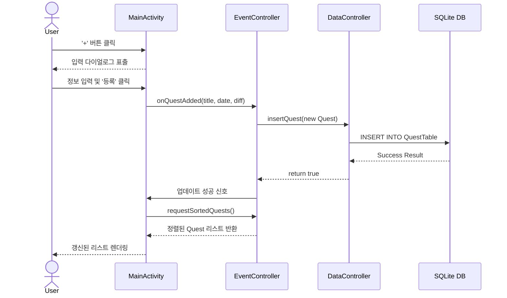

 

**[Description]** 
사용자가 메인 화면에서 새로운 퀘스트를 등록하는 과정이다. 사용자가 '+' 버튼을 눌러 과제명, 마감일, 난이도를 입력하고 등록을 요청하면, MainActivity는 이 데이터를 EventController로 전달한다. 컨트롤러는 DataController를 호출해 입력받은 퀘스트 데이터를 SQLite DB에 INSERT 쿼리로 저장한다. 저장이 성공적으로 완료되면, 뷰는 화면을 갱신하기 위해 다시 컨트롤러에 퀘스트 목록을 요청하고, 재정렬된 리스트를 받아와 사용자에게 표출한다.

  

### 3.2 Modify / Delete Quest (퀘스트 수정 및 삭제)
그림 3-2는 이미 등록된 퀘스트를 수정하거나 삭제할 때의 상호작용을 나타낸다.

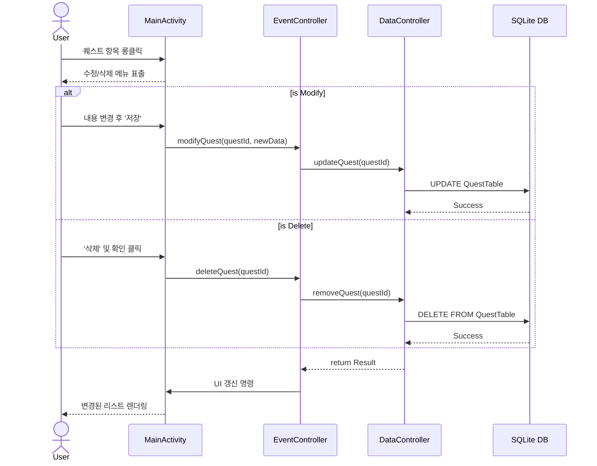

 

**[Description]** 
사용자가 등록된 퀘스트의 세부 정보를 수정하거나 완료할 필요가 없는 퀘스트를 리스트에서 삭제하는 흐름이다. 퀘스트 항목을 길게 누르면 조작 메뉴가 표출되며, 유저의 분기(수정 또는 삭제) 선택에 따라 EventController가 서로 다른 로직을 수행한다. DataController에게 UPDATE 혹은 DELETE 쿼리 실행을 지시하며, 트랜잭션이 완료되면 변경된 데이터를 기준으로 화면의 리스트를 새로고침하여 사용자가 수정된 결과를 즉각적으로 확인할 수 있도록 보장한다.

 

- 9 -
Yeungnam University

--- 

### 3.3 Complete Quest (퀘스트 완료 처리)
그림 3-3은 퀘스트 완수 후 보상을 획득하고 레벨업 여부를 판단하는 과정을 나타낸다.

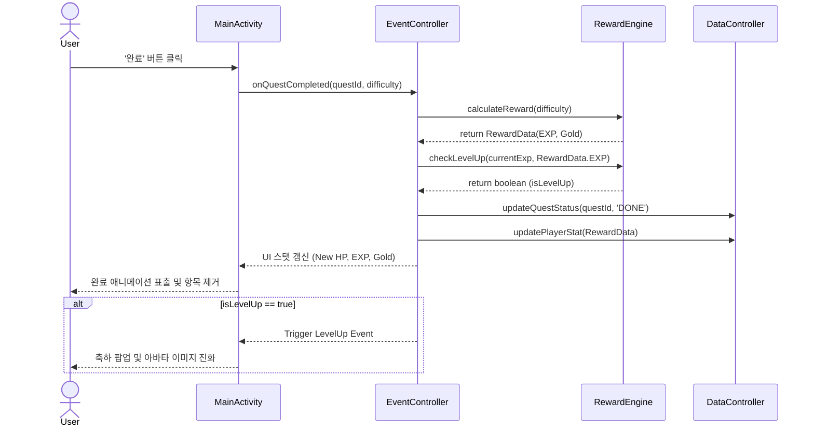

 

**[Description]** 
사용자가 현실에서 과제를 완수하고 앱 내에서 '완료' 버튼을 클릭했을 때 발생하는 일련의 연산 과정이다. EventController는 완료 이벤트를 감지하고 RewardEngine에 해당 퀘스트 난이도 기반의 보상 계산을 요청한다. 동시에 획득한 경험치를 바탕으로 레벨업 조건 달성 여부(isLevelUp)를 검증한다. 계산된 최종 스탯은 DataController를 통해 DB에 반영되며, 성공 시 뷰는 퀘스트를 리스트에서 제거하고 스탯 바를 채운다. 만약 레벨업을 했다면 아바타가 다음 단계로 진화하는 특별 이벤트가 함께 트리거된다.

  

### 3.4 View Quest List (정렬된 퀘스트 목록 조회)
그림 3-4는 마감일과 난이도에 따라 가장 시급한 퀘스트를 정렬하여 보여주는 과정을 나타낸다.

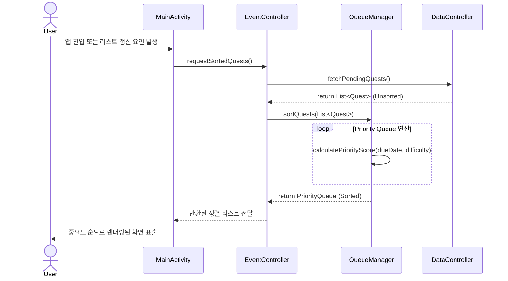

 

**[Description]** 
앱이 최초 실행되거나 퀘스트의 추가/완료로 인해 데이터에 변화가 생겼을 때, 가장 시급한 과제부터 화면에 배치하기 위해 리스트를 정렬하는 핵심 과정이다. 화면 렌더링 요청이 오면, 컨트롤러는 DataController에서 완료되지 않은(Pending) 퀘스트 목록을 모두 가져온다. 이후 이 무작위 데이터를 QueueManager로 넘겨 잔여 시간과 난이도 가중치를 합산한 우선순위 큐(Priority Queue) 정렬 연산을 수행한다. 최적화된 순서로 정렬된 퀘스트 배열이 View로 반환되어 사용자에게 가장 급한 과제를 최상단에 노출한다.

 

- 10 -
Yeungnam University

--- 

### 3.5 View Avatar Status (아바타 및 스탯 조회)
그림 3-5는 상단 UI에 플레이어의 상태와 캐릭터를 동기화하여 출력하는 과정을 나타낸다.

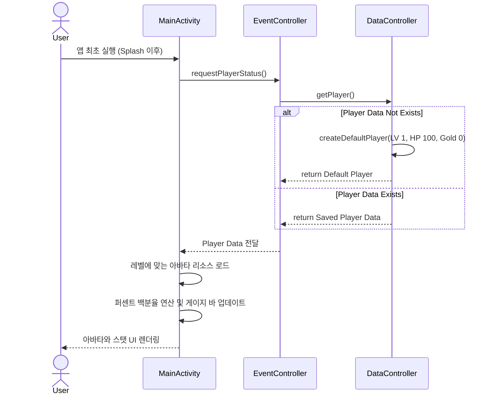

 

**[Description]** 
메인 화면 상단에 위치한 플레이어의 현재 레벨, 체력(HP), 경험치(EXP), 골드(Gold) 상태를 동기화하여 보여주는 흐름이다. 뷰가 로드될 때 EventController는 DataController를 통해 DB에 저장된 플레이어 테이블의 최신 레코드를 가져온다. 이때 초기 설치로 인해 데이터가 비어있다면, 시스템은 기본값(Level 1, HP 100)을 생성하여 저장한다. 가져온 데이터를 바탕으로 View는 현재 레벨에 맞는 아바타 이미지를 드로어블 리소스에서 매핑하고, 최대치 대비 현재 스탯을 백분율로 환산하여 프로그레스 바(Progress Bar) 형태의 게이지를 채워 넣는다.

  

### 3.6 Buy Item (상점 아이템 구매)
그림 3-6은 골드를 지불하고 커스텀 보상 아이템을 구매하는 과정을 나타낸다.

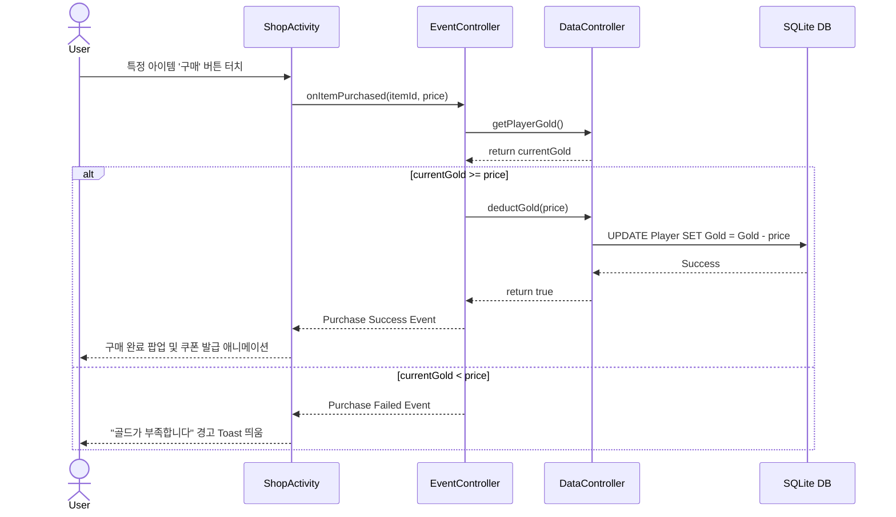

 

**[Description]** 
사용자가 퀘스트를 통해 모은 골드를 소비하여 상점에서 셀프 보상(Self-Reward) 아이템을 구매하는 과정이다. ShopActivity에서 구매 버튼을 누르면, EventController가 즉시 DataController를 통해 현재 플레이어의 보유 골드가 아이템 가격보다 크거나 같은지 트랜잭션 검증(Validation)을 수행한다. 잔액이 충분할 경우 골드를 차감하여 DB를 갱신하고 ShopActivity로 성공 신호를 보내 화려한 쿠폰 발급 애니메이션을 띄운다. 반면 잔액이 부족할 경우 데이터 변경 없이 거절(Failed) 이벤트를 리턴하여 유저에게 직관적인 경고 메시지를 노출한다.

 

- 11 -
Yeungnam University

--- 

### 3.7 Generate Daily Quest (일일 퀘스트 자정 갱신)
그림 3-7은 시스템이 백그라운드에서 매일 새로운 과제를 자동 부여하는 과정을 나타낸다.

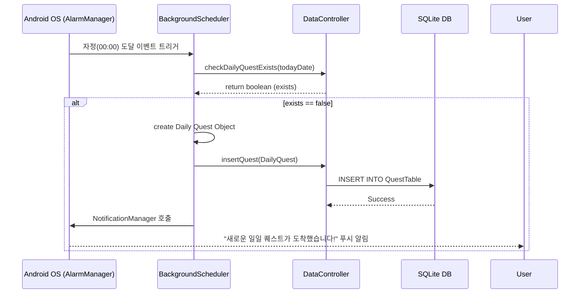

 

**[Description]** 
자정(00:00)이 되면 사용자가 별도로 앱을 실행하지 않더라도 시스템이 백그라운드에서 자동으로 일일 퀘스트를 생성하여 추가하는 기능이다. 안드로이드 시스템의 AlarmManager가 자정을 기점으로 BackgroundScheduler를 깨운다. 스케줄러는 중복 생성을 방지하기 위해 DB에 당일 퀘스트가 이미 있는지 검증한 후, 미리 정의된 가벼운 루틴 과제(예: 영단어 10개 외우기) 객체를 생성하여 DB에 삽입한다. 데이터베이스 작업이 끝난 후에는 Notification 채널을 통해 유저에게 푸시 알림을 발송하여 앱 접속을 유도한다.

  

### 3.8 Apply Penalty (마감일 초과 페널티 적용)
그림 3-8은 마감일이 지나 실패한 퀘스트를 색출하여 HP를 차감하는 과정을 나타낸다.

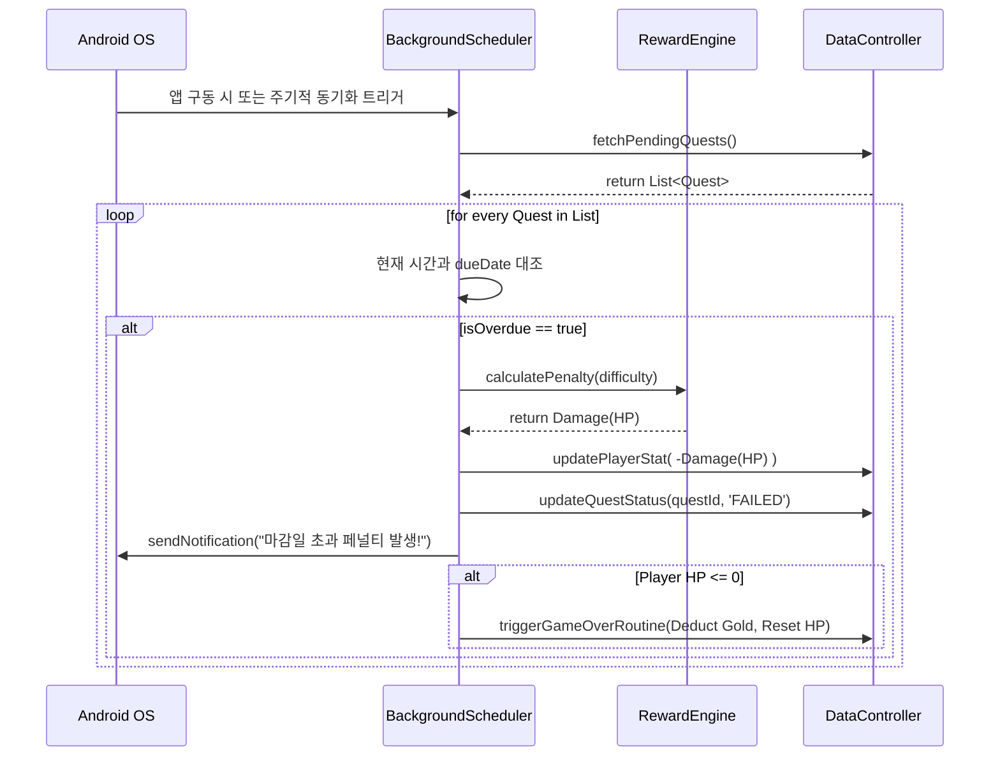

 

**[Description]** 
사용자가 등록한 과제의 마감 기한을 넘겼을 때, 이를 징벌하여 강제성을 부여하는 페널티 적용 흐름이다. 백그라운드 스케줄러가 미완료 퀘스트를 가져와 현재 시스템 시간과 비교한다. 마감일이 경과했음이 확인되면 RewardEngine을 통해 난이도에 비례하여 차감할 HP를 연산한다. 이후 해당 퀘스트를 실패(Failed) 상태로 버리고 플레이어의 체력을 깎는다. 만약 체력이 0 이하로 떨어졌다면, 보유 골드의 일부를 압류하고 체력을 다시 채워주는 시스템적 '게임 오버' 루틴을 추가로 실행하여 유저에게 긴장감을 준다.

 

- 12 -
Yeungnam University

--- 

### 3.9 Alert Penalty (마감일 임박 경고 알림)
그림 3-9는 마감 시간이 24시간 이내로 다가온 과제에 대해 경고 알림을 발송하는 과정을 나타낸다.

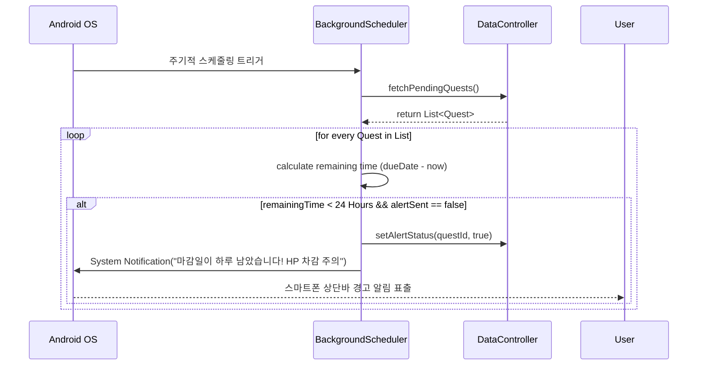

 

**[Description]** 
특정 퀘스트의 마감 기한이 24시간 이내로 임박했을 때, 앱을 켜지 않은 상태에서도 사용자에게 미리 경고하여 페널티(HP 차감)를 방지하도록 돕는 안전망 흐름이다. 스케줄러가 미완료 퀘스트들의 남은 시간을 연산하여 24시간 미만인 데이터를 탐지한다. 이미 알림을 보냈는지 확인하는 중복 방지 플래그(alertSent)를 체크한 뒤, 안드로이드 OS의 NotificationManager를 호출한다. "마감일이 하루 남았습니다!"라는 텍스트를 푸시 알림으로 띄움으로써, 게으름을 피우는 사용자의 즉각적인 행동과 과제 수행을 강력하게 촉구한다.

      

- 13 -
Yeungnam University

--- 

## 4. State Machine Diagram

### 4.1 Quest Lifecycle (퀘스트 상태 전이도)
그림 4-1은 퀘스트 객체가 시스템 내에서 경험하는 상태 변화와 라이프사이클을 나타낸다.

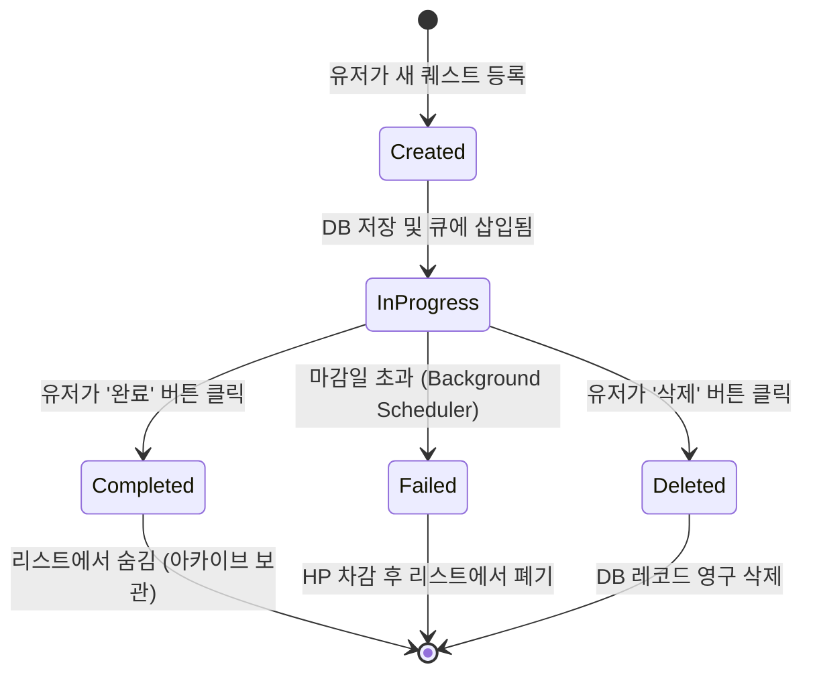

 

**[Description]** 
퀘스트(할 일) 데이터가 생성된 직후부터 최종적으로 처리되어 폐기될 때까지의 생명 주기(Lifecycle)를 나타내는 상태 전이도이다. 유저가 새로운 과제를 등록하면 Created 상태를 잠시 거쳐 리스트에 활성화된 InProgress 상태가 된다. 이 상태에서 유저가 할 일을 끝내고 완료를 누르면 Completed 상태가 되어 경험치를 지급한 뒤 아카이브된다. 만약 마감일이 지나면 백그라운드 스케줄러에 의해 강제로 Failed 상태로 변이되며 페널티를 유발한다. 유저가 임의로 삭제를 누르면 Deleted 상태가 되어 DB에서 완전히 파기된다. 종료 상태(Final State)에 도달한 퀘스트는 더 이상 상태가 변하지 않는다.

  

### 4.2 App View State (애플리케이션 화면 상태 전이도)
그림 4-2는 사용자의 터치 조작에 따라 변화하는 앱 화면(View) 간의 상태 흐름을 나타낸다.

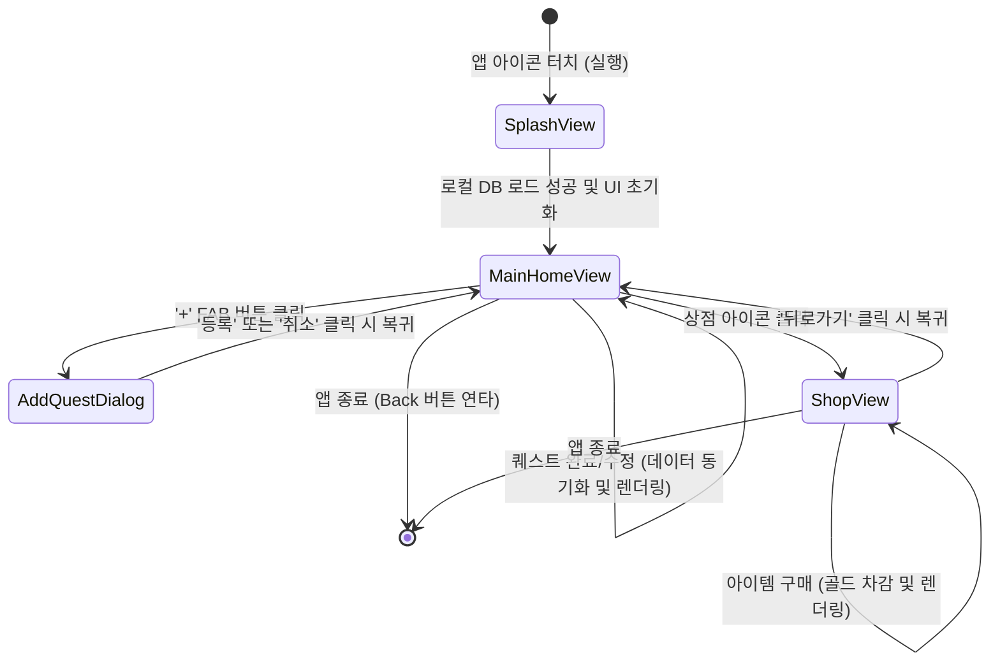

 

**[Description]** 
모바일 애플리케이션 화면(UI/UX) 측면에서 사용자의 조작에 따라 변화하는 상태 흐름을 정의한다. 사용자가 앱을 처음 실행하면 SplashView에서 로딩을 거쳐 메인 공간인 MainHomeView로 진입한다. 이곳을 시스템의 허브(Hub)로 삼아, FAB 버튼을 눌러 AddQuestDialog 상태(모달 팝업)로 넘어가거나 상점 아이콘을 눌러 ShopView 상태로 진입할 수 있다. 팝업에서 입력을 마치거나 상점에서 뒤로 가기를 누르면 반드시 다시 MainHomeView로 복귀하도록 설계되어 있다. 이를 통해 유저가 앱 내에서 길을 잃지 않고 언제든 자신의 아바타 상태를 파악할 수 있는 안정적인 상태 전이를 보장한다.

 

- 14 -
Yeungnam University

--- 

## 5. Implementation Requirements

본 시스템을 구현하고 원활하게 동작시키기 위한 소프트웨어 및 하드웨어의 최소 요구사항은 다음과 같다.

**[S/W Requirements]**
* OS: Android 8.0 (API Level 26, Oreo) 이상 (알람 매니저 및 백그라운드 제한 정책 대응)
* Language: Java 또는 Kotlin
* IDE: Android Studio 2022.3 (Giraffe) 이상
* Database: SQLite (안드로이드 기본 내장 라이브러리)
* Architecture: MVC (Model-View-Controller) 아키텍처 패턴 적용

 

**[H/W Requirements]**
* Platform: 안드로이드 OS를 탑재한 스마트폰 (태블릿 환경 제외)
* CPU: 쿼드코어 1.4 GHz 이상 (우선순위 큐 연산 및 애니메이션 렌더링용)
* RAM: 2GB 이상
* Storage: 최소 100MB 이상의 여유 공간 (로컬 DB 및 이미지 리소스 저장)
* Network: 오프라인 완전 동작 지원 (서버 연결 없이 스탠드얼론으로 동작)

     

- 15 -
Yeungnam University

--- 

## 6. Glossary

<table frame="box" rules="all" width="100%">
  <tr>
    <th width="150" align="center" bgcolor="#f2f2f2">용어</th>
    <th width="650" align="center" bgcolor="#f2f2f2">설명</th>
  </tr>
  <tr>
    <td align="center"><b>MVC Pattern</b></td>
    <td>Model(데이터), View(화면), Controller(제어)로 역할을 분리하여 소프트웨어를 설계하는 아키텍처 패턴. 유지보수가 용이하다.</td>
  </tr>
  <tr>
    <td align="center"><b>EventController</b></td>
    <td>View에서 발생한 이벤트를 캡처하여 데이터 조작 비즈니스 로직을 연결하는 핵심 제어 컴포넌트.</td>
  </tr>
  <tr>
    <td align="center"><b>Priority Queue (우선순위 큐)</b></td>
    <td>데이터가 큐에 삽입된 순서가 아니라, 수학적으로 연산된 특정 규칙(우선순위 점수)에 의해 가장 중요한 요소부터 빠져나가는 힙(Heap) 기반 자료구조.</td>
  </tr>
  <tr>
    <td align="center"><b>SQLite</b></td>
    <td>별도의 외부 데이터베이스 서버가 필요 없는, 기기 내부에 저장되는 경량화된 로컬 관계형 데이터베이스 시스템.</td>
  </tr>
  <tr>
    <td align="center"><b>Background Scheduler</b></td>
    <td>사용자가 앱을 화면에 띄워 직접 조작하고 있지 않은 상태(화면 꺼짐, 다른 앱 사용 등)에서도 시간에 맞춰 백그라운드에서 은밀히 동작하는 프로세스.</td>
  </tr>
</table>

 

## 7. References

1) Android Developers Official Documentation, https://developer.android.com
2) Java Platform, Standard Edition Documentation (Oracle), https://docs.oracle.com/en/java/
3) "Introduction to Algorithms, 3rd Edition" (Thomas H. Cormen) - 우선순위 큐(Priority Queue) 수학적 구현 참조
4) "Android Room & SQLite Database Guide", Android Developers.
5) "새해 계획 얼마나 지켰나?…대학생 70% '작심삼일'", 노컷뉴스, 2014.01.10.
6) "대학생이 꼽은 시간 허비 이유 '1위 귀차니즘'", 서울시티, 2014.02.28.
